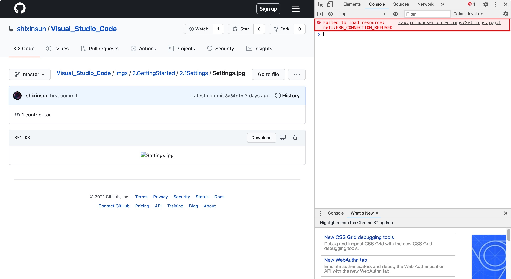
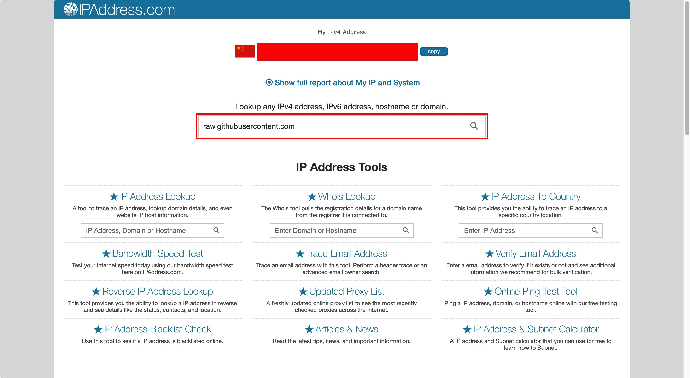
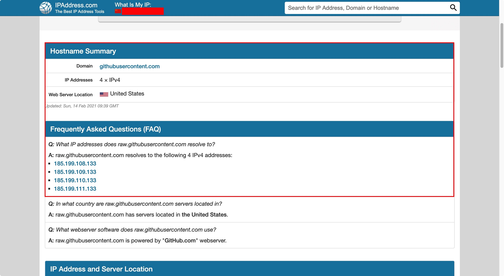

# Shixin SUN‘ GitHub

Hi! This is Shixin SUN‘s GitHub and [**CV**](https://shixinsun.github.io/).

------

# Here are some ideas to get you started: 

- 🔭 I’m currently working on **Shenyang**.
- 🌱 I’m currently learning **Fault Diagnosis Algorithm**.
- 👯 I’m looking to collaborate on None.
- 🤔 I’m looking for help with None.
- 💬 Ask me about **Fault Diagnosis Algorithm**.
- 📫 How to reach me: sunshixin@sia.com .
- 😄 Pronouns: **He/Him**.
- ⚡ Fun fact: None.

------

# Perception Algorithm notes are being arranged:

## 1. 数学基础

#### 1.1 高等数学

#### 1.2 矩阵分析

#### 1.3 概率论与数理统计

#### 1.4 复变函数

#### 1.5 离散数学

#### 1.6 凸优化

## 2. 编程语言基础

#### [2.0 Visual Stuido Code](https://github.com/shixinsun/Visual_Studio_Code)

#### [2.1 Markdown](https://github.com/shixinsun/Markdown)

#### 2.2 $\LaTeX$

#### 2.3 Git

#### 2.4 汇编语言

#### 2.5 C

#### 2.6 C++

#### 2.7 CUDA

#### 2.8 Python

#### 2.9 Matlab

## 3. 计算机体系基础

#### 3.1 UNIX

#### 3.2 Linux

#### 3.3 数据结构与算法

#### 3.4 计算机组成原理

#### 3.5 操作系统

#### 3.6 计算机网络

#### 3.7 数据库

#### 3.8 编译原理

## 4. AI 算法基础

#### 4.1 2D 图像处理

#### 4.2 3D 图像处理

#### 4.3 机器学习

#### 4.4 深度学习

#### 4.5 强化学习

## 5. 环境感知

#### 5.1 目标识别

#### 5.2 目标检测

#### 5.3 语义分割

#### 5.4 目标跟踪

#### 5.5 场景流

## 6. 定位

#### 6.1 激光 SLAM

#### 6.2 视觉 SLAM

#### 6.3 多传感器融合

------

> #### a. 解决数学公式无法显示问题
>
> 可在 Google Chrome 浏览器中安装 [MathJax Plugin for Github](https://chrome.google.com/webstore/detail/mathjax-plugin-for-github/ioemnmodlmafdkllaclgeombjnmnbima) 来显示 GitHub 上无法显示的数学公式，安装步骤如下：
>
> 1. 点击右上角的 “添加至 Chrome”；
> 2. 出现对话框询问是否添加该插件，点击对话框的 “添加扩展程序” 按钮；
> 3. 提示插件已添加到 Chrome 后，即可在 GitHub 中正常显示数学公式。
>
> #### b. 解决图片无法显示问题
>
> 为解决 GitHub 无法显示图片的问题，可采用如下步骤：
>
> 1. 如下图所示，针对某一幅无法打开的图片，按下 F12 打开控制台，可以看到此图片的 URL（`https://raw.githubusercontent.com/shixinsun/Visual_Studio_Code/master/imgs/2.GettingStarted/2.1Settings/Settings.jpg`） 和加载失败的原因（Failed to load resource: net::ERR_CONNECTION_REFUSED）;
>
>    
>
> 2. 在 [IPAddress.com](https://www.ipaddress.com/) 中输入上述 URL 的二级域名，即 raw.githubusercontent.com，可得到该域名的信息和 IP 地址，如下图所示；
>
>    
>
>    
>
> 3. 在 macOS 系统下，在 Terminal 中输入下述命令打开 hosts：
>
>    ```
>    sudo vim /etc/hosts
>    ```
>
> 4. 将下述信息写入到 hosts 中，刷新网页后即可显示出图片。
>
>    ```
>    185.199.108.133 raw.githubusercontent.com
>    185.199.109.133 raw.githubusercontent.com
>    185.199.110.133 raw.githubusercontent.com
>    185.199.111.133 raw.githubusercontent.com
>    ```

------

## This is my GitHub Stats

[](https://github.com/shixinsun/github-readme-stats)

